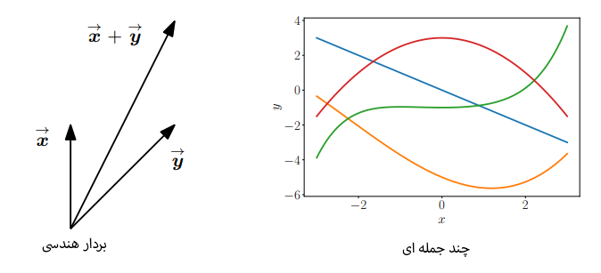

# 01. جبر خطی

این فصل با تعریف **جبر خطی** به عنوان مطالعه **بردارها** و قوانین مشخصی برای دستکاری آن‌ها آغاز می‌شود.

نکته اصلی این بخش، ارائه یک تعریف کلی و انتزاعی از **بردار** است. بر اساس این تعریف، بردارها اشیاء خاصی هستند که می‌توانند با یکدیگر **جمع شوند** و **در یک اسکالر ضرب شوند** و نتیجه همچنان شیئی از همان نوع باشد. این یک مفهوم کلیدی است، زیرا هر شیئی که این دو ویژگی را داشته باشد، می‌تواند یک بردار در نظر گرفته شود.

برای روشن‌تر شدن این مفهوم انتزاعی، چندین مثال از انواع مختلف بردارها ارائه شده است:

1.  **بردارهای هندسی (Geometric vectors):** این بردارها که از ریاضیات و فیزیک دبیرستان آشنا هستند، به صورت پاره‌خط‌های جهت‌دار نمایش داده می‌شوند. حاصل جمع دو بردار هندسی یا حاصل ضرب یک بردار هندسی در یک اسکالر، همچنان یک بردار هندسی است. این نوع بردارها به ما کمک می‌کنند تا از شهود خود در مورد جهت و اندازه برای درک عملیات ریاضی استفاده کنیم.

2.  **چندجمله‌ای‌ها (Polynomials):** به طور شگفت‌انگیزی، چندجمله‌ای‌ها نیز بردار محسوب می‌شوند، زیرا حاصل جمع دو چندجمله‌ای یا ضرب یک چندجمله‌ای در یک اسکالر، همچنان یک چندجمله‌ای است. این مثال نشان می‌دهد که مفهوم بردار فراتر از بردارهای هندسی است و می‌تواند شامل مفاهیم انتزاعی نیز باشد.

3.  **سیگنال‌های صوتی (Audio signals):** این سیگنال‌ها که به صورت مجموعه‌ای از اعداد نمایش داده می‌شوند، بردار هستند زیرا می‌توان آن‌ها را با هم جمع کرد یا در یک اسکالر ضرب کرد و نتیجه همچنان یک سیگنال صوتی خواهد بود.

4.  **عناصر $R^n$ (Elements of R^n):** این نوع بردارها که به صورت تاپل‌هایی از اعداد حقیقی (مثلاً⊤) هستند، **محور اصلی این کتاب** را تشکیل می‌دهند. دلیل این تمرکز آن است که اکثر الگوریتم‌های جبر خطی در R^n فرمول‌بندی شده‌اند و داده‌ها در یادگیری ماشین اغلب به صورت بردارهایی در R^n نمایش داده می‌شوند. این بردارها با جمع مؤلفه‌به‌مؤلفه و ضرب در اسکالر، همچنان برداری در R^n باقی می‌مانند. همچنین این نمایش با آرایه‌ها در کامپیوتر مطابقت دارد که پیاده‌سازی الگوریتم‌ها را راحت می‌کند.

$$
\cos x=\sum_{k=0}^{\infty}\frac{(-1)^k}{(2k)!}x^{2k}
$$

{ loading=lazy }
/// caption

///

این بخش در نهایت به مفهوم **«بسته بودن» (closure)** اشاره می‌کند که به این سؤال می‌پردازد: با شروع از مجموعه‌ای کوچک از بردارها و انجام عملیات جمع و ضرب اسکالر، چه مجموعه بردارهایی را می‌توان تولید کرد؟ این ایده به مفهوم **فضای برداری (vector space)** منجر می‌شود که در ادامه فصل (بخش ۲.۴) به آن پرداخته خواهد شد و اساس بسیاری از مفاهیم یادگیری ماشین است.

منابعی عالی برای مطالعه بیشتر جبر خطی نیز معرفی شده‌اند، از جمله دوره درسی گیلبرت استرنگ در MIT و مجموعه ویدئوهای 3Blue1Brown.