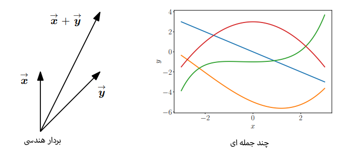

# 02. جبر خطی

این فصل به یکی از مهم‌ترین ستون‌های ریاضیات برای یادگیری ماشین، یعنی **جبر خطی**، می‌پردازد.

**جبر چیست و جبر خطی درباره چیست؟**

قبل از هر چیز، بیایید ببینیم منظور از "جبر" (algebra) چیست. جبر به طور کلی یعنی مجموعه‌ای از اشیاء (مثل اعداد یا نمادها) و قوانینی برای کار با آن اشیاء.

**جبر خطی**، به طور خاص، مطالعه‌ی **بردارها (vectors)** و قوانینی برای دستکاری و ترکیب آن‌هاست. احتمالاً شما با "بردارهای هندسی" که در دبیرستان و فیزیک با یک فلش کوچک بالایشان نمایش داده می‌شدند (مثلاً $\vec{x}$)، آشنا هستید. در این کتاب، ما مفهوم کلی‌تری از بردارها را بررسی می‌کنیم و آن‌ها را با حروف ضخیم (bold) نمایش می‌دهیم (مثلاً **x** و **y**).

**بردار واقعاً چیست؟ (فراتر از یک فلش)**

مفهوم کلیدی این است: بردارها اشیائی هستند که می‌توان آن‌ها را با هم **جمع** کرد و در یک عدد (که به آن **اسکالر** یا **scalar** می‌گوییم) **ضرب** کرد، و نتیجه‌ی این عملیات‌ها دوباره یک بردار از همان نوع خواهد بود.

این تعریف بسیار کلی و قدرتمند است و به ما اجازه می‌دهد تا اشیاء بسیار متفاوتی را "بردار" بنامیم. کتاب به چهار مثال مهم اشاره می‌کند تا این دیدگاه را باز کند:

1.  **بردارهای هندسی (Geometric Vectors):** این همان برداری است که از فیزیک و دبیرستان می‌شناسیم: یک پاره‌خط جهت‌دار که طول و جهت مشخصی دارد.
    * **جمع:** جمع دو بردار هندسی، بردار جدیدی ایجاد می‌کند (قانون متوازی‌الاضلاع).
    * **ضرب اسکالر:** ضرب یک بردار در یک عدد، طول آن را تغییر می‌دهد (و اگر عدد منفی باشد، جهت را برعکس می‌کند)، اما نتیجه همچنان یک بردار هندسی است.
    این بردارهای قابل‌تجسم به ما کمک می‌کنند تا عملیات ریاضی را به صورت شهودی درک کنیم.

2.  **چندجمله‌ای‌ها (Polynomials):** این یک مثال شگفت‌انگیز و غیرمنتظره است! چندجمله‌ای‌ها هم بردار هستند، چون از قوانین اصلی پیروی می‌کنند:
    * **جمع:** اگر دو چندجمله‌ای را با هم جمع کنید، حاصل یک چندجمله‌ای جدید است.
    * **ضرب اسکالر:** اگر یک چندجمله‌ای را در یک عدد ضرب کنید، حاصل همچنان یک چندجمله‌ای است.
    بنابراین، با اینکه چندجمله‌ای‌ها مثل بردارهای هندسی "قابل رسم" نیستند، اما از نظر ریاضیاتی، آن‌ها هم بردار محسوب می‌شوند.

3.  **سیگنال‌های صوتی (Audio Signals):** یک سیگنال صوتی به صورت مجموعه‌ای از اعداد نمایش داده می‌شود. سیگنال‌های صوتی هم بردار هستند:
    * **جمع:** می‌توانید دو سیگنال صوتی را با هم جمع کنید (مثل میکس کردن دو آهنگ) و یک سیگنال صوتی جدید بسازید.
    * **ضرب اسکالر:** می‌توانید یک سیگنال صوتی را در یک عدد ضرب کنید (مثلاً برای کم و زیاد کردن ولوم) و نتیجه همچنان یک سیگنال صوتی خواهد بود.

4.  **عناصر فضای ℝⁿ یا (Elements of ℝⁿ):** این همان مفهومی است که در این کتاب و در یادگیری ماشین بیشترین کاربرد را دارد. یک عنصر در فضای ℝⁿ، یک **تاپل (tuple)** یا لیستی مرتب از *n* عدد حقیقی است. برای مثال:
    $\mathbf{a} = \begin{bmatrix} 1 \\ 2 \\ 3 \end{bmatrix} \in \mathbb{R}^3$
    این عناصر هم بردار هستند:
    * **جمع:** جمع دو بردار در ℝⁿ به صورت مؤلفه‌به‌مؤلفه انجام می‌شود و حاصل، برداری دیگر در همان فضاست.
    * **ضرب اسکالر:** ضرب یک بردار در ℝⁿ در یک عدد اسکالر، تک‌تک مؤلفه‌های آن را در آن عدد ضرب می‌کند و نتیجه باز هم یک بردار در همان فضاست.
    یک مزیت بزرگ این نوع بردارها این است که به راحتی با **آرایه‌ها (arrays)** در زبان‌های برنامه‌نویسی مطابقت دارند و پیاده‌سازی الگوریتم‌ها را ساده می‌کنند.

{ loading=lazy }
/// caption

///

**هدف این فصل چیست؟**

جبر خطی بر شباهت‌های بین این مفاهیمِ برداری تمرکز دارد. همه‌ی آن‌ها را می‌توان جمع کرد و در اسکالر ضرب کرد.

یکی از ایده‌های اصلی در ریاضیات، مفهوم **"بسته بودن" (closure)** است. سؤال این است: "مجموعه‌ی تمام چیزهایی که می‌توانند از عملیات پیشنهادی من حاصل شوند، چیست؟"

در مورد بردارها، سؤال این است: اگر با مجموعه‌ی کوچکی از بردارها شروع کنیم و آن‌ها را با هم جمع و در اعداد اسکالر ضرب کنیم، به چه مجموعه‌ای از بردارها می‌رسیم؟ این مفهوم به **"فضای برداری" (vector space)** منجر می‌شود که در بخش‌های بعدی به تفصیل بررسی خواهد شد و اساس بسیاری از مفاهیم یادگیری ماشین است.

## دستگاه معادلات خطی

دستگاه معادلات خطی بخش اصلی و مرکزی جبر خطی را تشکیل می‌دهند. بسیاری از مسائل را می‌توان به صورت یک دستگاه معادلات خطی فرمول‌بندی کرد و جبر خطی ابزارهای لازم برای حل آن‌ها را در اختیار ما قرار می‌دهد.

---
**مثال کاربردی: برنامه‌ریزی تولید یک شرکت** 🏭

برای درک بهتر موضوع، کتاب با یک مثال شروع می‌کند. فرض کنید شرکتی *n* نوع محصول مختلف ($N_1, ..., N_n$) تولید می‌کند که برای ساخت آن‌ها به *m* نوع منبع اولیه ($R_1, ..., R_m$) نیاز دارد.

* برای تولید **یک واحد** از محصول $N_j$، مقدار $a_{ij}$ از منبع $R_i$ مورد نیاز است.
* هدف ما پیدا کردن یک برنامه تولید بهینه است؛ یعنی می‌خواهیم بدانیم از هر محصول $N_j$ چه تعداد (که آن را با متغیر $x_j$ نشان می‌دهیم) باید تولید کنیم.
* این برنامه تولید باید به گونه‌ای باشد که اگر در مجموع $b_i$ واحد از منبع $R_i$ در دسترس داریم، در حالت ایده‌آل هیچ منبعی باقی نماند.

اگر از محصولات مختلف به تعداد $x_1, ..., x_n$ تولید کنیم، کل منبع $R_i$ که مصرف می‌شود برابر است با:
$a_{i1}x_1 + \dots + a_{in}x_n$ بنابراین، برای یک برنامه تولید بهینه، باید دستگاهی از معادلات زیر برقرار باشد:$\begin{align*} a_{11}x_1 + \dots + a_{1n}x_n &= b_1 \\ \vdots \qquad & \qquad \vdots \\ a_{m1}x_1 + \dots + a_{mn}x_n &= b_m \end{align*}$
این فرم کلی یک **دستگاه معادلات خطی** (system of linear equations) است.

---
**تعریف راه حل (Solution)**

در دستگاه بالا، $x_1, ..., x_n$ مجهولات دستگاه هستند. هر مجموعه‌ای از اعداد (n-تایی) مثل $(x_1, ..., x_n)$ که تمام معادلات دستگاه را به طور همزمان برآورده کند، یک **جواب** (solution) برای آن دستگاه محسوب می‌شود.

---
**یک دستگاه چند جواب می‌تواند داشته باشد؟**

برای یک دستگاه معادلات خطی با مقادیر حقیقی، به طور کلی سه حالت ممکن است رخ دهد: هیچ جوابی وجود نداشته باشد، دقیقاً یک جواب یکتا وجود داشته باشد، یا بی‌نهایت جواب وجود داشته باشد.

1.  **هیچ جوابی (No solution):** 🤷‍♂️ گاهی معادلات با یکدیگر در تناقض هستند. برای مثال، اگر از جمع دو معادله به نتیجه‌ی $2x_1 + 3x_3 = 5$ برسیم، اما معادله‌ی دیگری در دستگاه $2x_1 + 3x_3 = 1$ باشد، این تناقض نشان می‌دهد که هیچ جوابی وجود ندارد.
2.  **دقیقاً یک جواب (Unique solution):** ✅ در این حالت، تنها یک مجموعه از مقادیر برای مجهولات وجود دارد که تمام معادلات را ارضا می‌کند.
3.  **بی‌نهایت جواب (Infinitely many solutions):** ♾️ این حالت زمانی رخ می‌دهد که حداقل یکی از معادلات، ترکیبی خطی از معادلات دیگر باشد (یعنی اطلاعات جدیدی به دستگاه اضافه نکند و اضافی باشد). در این وضعیت، ما با **متغیرهای آزاد** (free variable) روبرو می‌شویم که می‌توانند هر مقداری اختیار کنند و به ازای هر مقدار، یک جواب برای دستگاه به دست می‌آید.

---
**تعبیر هندسی دستگاه معادلات خطی**

یک راه بسیار خوب برای درک شهودی این سه حالت، نگاه کردن به تعبیر هندسی آنهاست:

* **در فضای دو بعدی (2D):** هر معادله‌ی خطی با دو متغیر (مثلاً $x_1, x_2$) یک **خط** را در صفحه تعریف می‌کند. مجموعه جواب‌های دستگاه، همان محل برخورد یا فصل مشترک این خطوط است.
    * **یک جواب:** خطوط در یک نقطه متقاطع هستند.
    * **بی‌نهایت جواب:** خطوط بر هم منطبق هستند.
    * **هیچ جواب:** خطوط موازی هستند و هیچ برخوردی ندارند.

* **در فضای سه بعدی (3D):** هر معادله‌ی خطی با سه متغیر یک **صفحه** (plane) را در فضا مشخص می‌کند. مجموعه جواب‌ها، فصل مشترک این صفحات است که می‌تواند یک صفحه، یک خط، یک نقطه یا تهی (هیچ اشتراکی) باشد.

---
**نمایش فشرده: مقدمه‌ای بر ماتریس‌ها**

برای اینکه بتوانیم به طور سیستماتیک با این دستگاه‌ها کار کنیم، از یک نمایش فشرده‌تر استفاده می‌کنیم. دستگاه معادلات را می‌توان به صورت جمع ستون‌های ضرایب که در متغیرها ضرب شده‌اند، نوشت:
$\begin{bmatrix} a_{11} \\ \vdots \\ a_{m1} \end{bmatrix} x_1 + \begin{bmatrix} a_{12} \\ \vdots \\ a_{m2} \end{bmatrix} x_2 + \dots + \begin{bmatrix} a_{1n} \\ \vdots \\ a_{mn} \end{bmatrix} x_n = \begin{bmatrix} b_1 \\ \vdots \\ b_m \end{bmatrix}$و این عبارت را می‌توان به شکل فشرده‌ی ضرب ماتریس در بردار نمایش داد:$\begin{bmatrix} a_{11} & \dots & a_{1n} \\ \vdots & & \vdots \\ a_{m1} & \dots & a_{mn} \end{bmatrix} \begin{bmatrix} x_1 \\ \vdots \\ x_n \end{bmatrix} = \begin{bmatrix} b_1 \\ \vdots \\ b_m \end{bmatrix}$
که همان فرم معروف $Ax=b$ است. در بخش‌های بعدی، با ماتریس‌ها و قوانین حاکم بر آن‌ها بیشتر آشنا خواهیم شد.